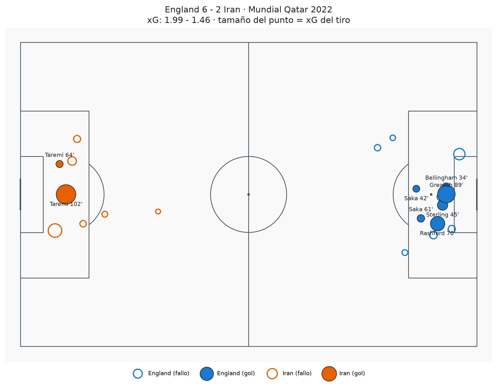
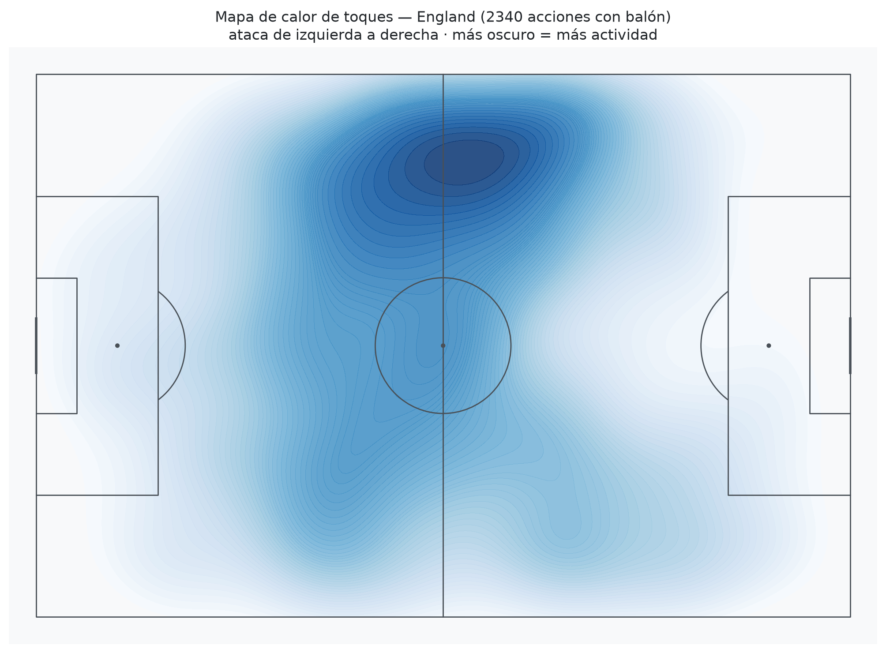
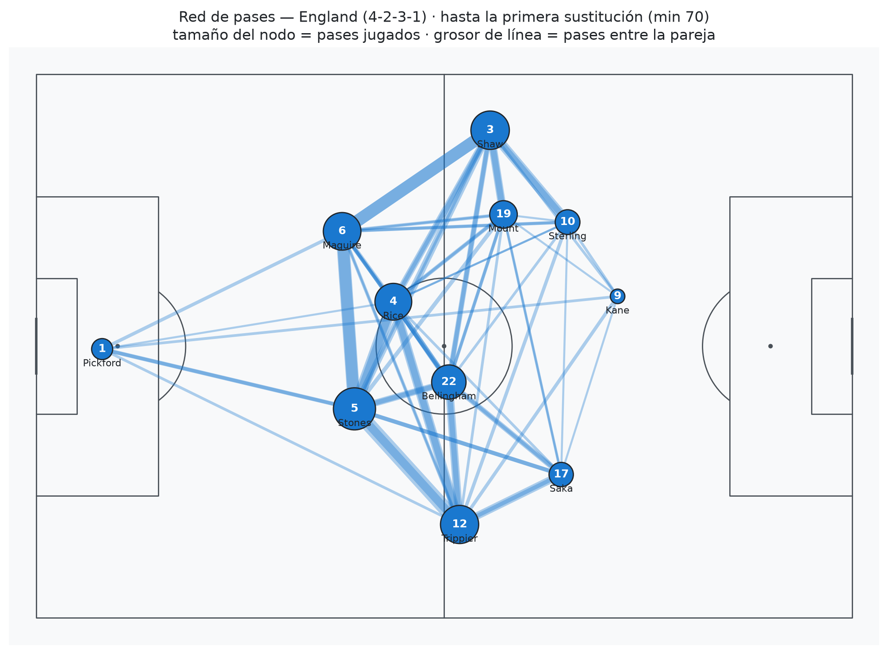

# ⚽ Soccer Analytics Lab

Proyecto de portafolio para explorar y explotar las posibilidades de la **ciencia de datos aplicada al fútbol**: desde datos de eventos (cada pase, tiro y duelo de un partido) hasta modelos predictivos, scouting de jugadores y pipelines en tiempo real.

## ¿Por qué fútbol + data science?

El fútbol es hoy una de las industrias más activas en analítica deportiva:

- **Clubes** (Liverpool, Brentford, Brighton) construyeron ventajas competitivas reales con equipos de data science: fichajes infravalorados, modelos de xG propios, análisis táctico.
- **Empresas del sector**: StatsBomb/Hudl, Opta (Stats Perform), SkillCorner, Zelus Analytics, Traits Insights — contratan data scientists constantemente.
- **Casas de apuestas y trading deportivo**: modelos de forecasting de resultados son el core del negocio.
- **Medios**: The Athletic, ESPN y similares consumen visualizaciones y métricas avanzadas.

Problemas típicos del dominio (y de este proyecto): modelos de **Expected Goals (xG)**, valoración de acciones (**VAEP**), redes de pases, **forecasting** de resultados (Poisson / Dixon-Coles / Elo), scouting por similitud de jugadores, y **pitch control** con datos de tracking.

## Vista previa — Fase 1 (datos reales del Mundial 2022)

Generadas en [notebooks/01_viz_mundial.ipynb](notebooks/01_viz_mundial.ipynb) con eventos de StatsBomb del Inglaterra 6-2 Irán:

| Shot map con xG | Heatmap de toques | Red de pases |
|---|---|---|
|  |  |  |

## Estructura

```
Soccer/
├── data/
│   ├── raw/          # datos descargados tal cual (no se versionan)
│   ├── processed/    # datos limpios/derivados (no se versionan)
│   └── synthetic/    # datos sintéticos generados (no se versionan)
├── docs/
│   ├── DATA_SOURCES.md   # dónde conseguir datos (histórico + tiempo real)
│   └── ROADMAP.md        # plan por fases del proyecto
├── notebooks/        # exploración y análisis (Jupyter)
├── scripts/
│   ├── download_statsbomb.py   # baja datos de eventos reales (StatsBomb Open Data)
│   └── generate_synthetic.py   # genera una liga sintética coherente (partidos + tiros con xG)
├── src/soccer/       # código reutilizable (paquete Python)
└── requirements.txt
```

## Stack

| Capa | Herramienta | Por qué |
|------|-------------|---------|
| Lenguaje | Python 3.11+ | estándar de facto en sports analytics |
| Datos | pandas / numpy | manipulación tabular |
| Almacenamiento | DuckDB + Parquet | SQL analítico local, sin servidor |
| Acceso a datos fútbol | `statsbombpy`, `soccerdata`, `kloppy` | wrappers de las fuentes públicas |
| Visualización | `mplsoccer` + matplotlib | campos, shot maps, pass networks |
| ML | scikit-learn, XGBoost | xG models, clustering de jugadores |
| App/Dashboard | Streamlit | demo interactiva para el portafolio |

## Quickstart

```powershell
# 1. Entorno virtual (recomendado Python 3.11/3.12 por compatibilidad de librerías)
python -m venv .venv
.\.venv\Scripts\Activate.ps1
pip install -r requirements.txt

# 2. Datos reales (StatsBomb Open Data) — descarga los torneos que quieras
python scripts/download_statsbomb.py --list                      # ver competiciones disponibles
python scripts/download_statsbomb.py                             # Mundial 2022 (64 partidos)
python scripts/download_statsbomb.py --competition 43 --season 3 # Mundial 2018
python scripts/download_statsbomb.py --competition 55 --season 282  # Euro 2024
python scripts/preprocess_statsbomb.py          # genera los Parquet del dashboard

# 3. O datos sintéticos: una liga completa de 20 equipos con tiros y xG
python scripts/generate_synthetic.py --seasons 3 --seed 42

# 4. Dashboard interactivo (bilingüe ES/EN)
streamlit run app/streamlit_app.py
```

Navegación del dashboard: eliges **torneo/liga → temporada** y de ahí ves las **estadísticas globales del torneo** (mapa xG a favor/en contra, goleadores vs xG) o el **partido a fondo** (carrera de xG, shot map, redes de pases, posesión por tramos y análisis por jugador). Aparte: panel del **Mundial 2026 en vivo** (API) y **Metodología** (de dónde salen los datos, qué es el xG, qué se puede replicar con event data vs tracking).

Para la pestaña del **Mundial 2026 en vivo**: registrarse gratis en [football-data.org](https://www.football-data.org/client/register) y exportar la key como `FOOTBALL_DATA_TOKEN` (o pegarla en la app).

Ver [docs/DATA_SOURCES.md](docs/DATA_SOURCES.md) para el catálogo completo de fuentes, [docs/ROADMAP.md](docs/ROADMAP.md) para el plan del proyecto, y [docs/DATOS_CLUB_PEQUENO.md](docs/DATOS_CLUB_PEQUENO.md) para cómo se genera el dato profesional y cómo replicarlo en un club amateur con poco presupuesto.
